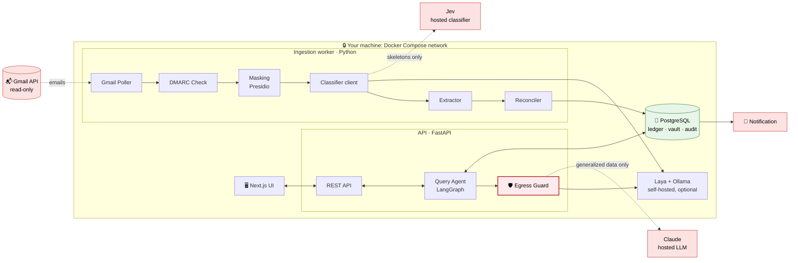
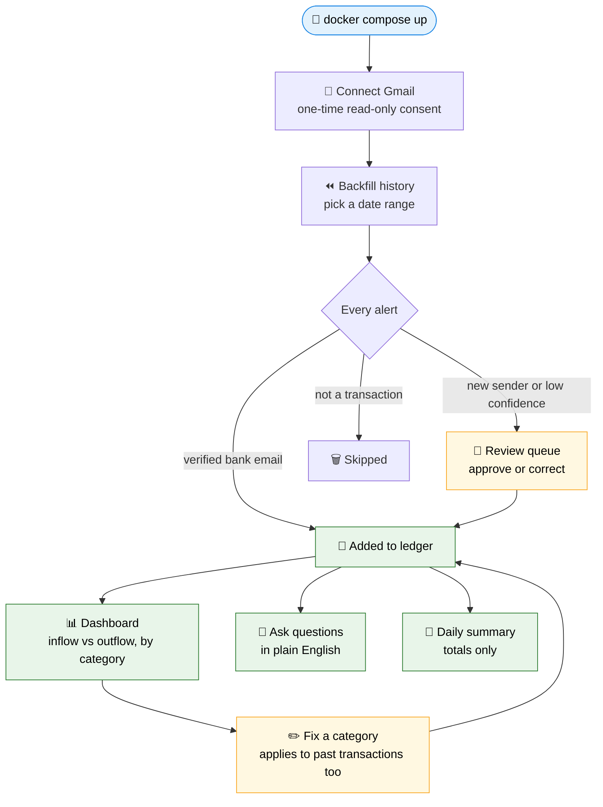
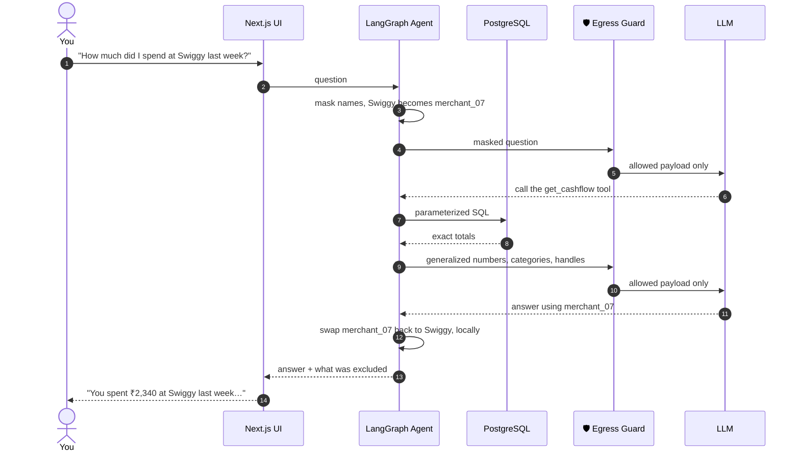
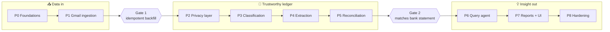

<div align="center">

# 📡 Money Radar

### _Where did my money go?_

**Money Radar watches your inbox for bank alerts and shows exactly where your money went, across every bank and currency, without your personal data ever leaving your control.**

<br/>

[](#roadmap)
[](#roadmap)
[](LICENSE)
[](#contributing)

[](https://www.python.org/)
[](https://fastapi.tiangolo.com/)
[](https://www.langchain.com/langgraph)
[](https://www.postgresql.org/)
[](https://nextjs.org/)
[](https://docs.docker.com/compose/)

<br/>

[Problem](#problem) · [Solution](#solution) · [Architecture](#architecture) · [User flow](#user-flow) · [Privacy](#privacy) · [Tech stack](#tech-stack) · [Roadmap](#roadmap)

</div>

---

> [!IMPORTANT]
> **Privacy is the core design rule.** No direct identifier (account numbers, card numbers, UPI IDs, PAN, names, phone numbers or emails) ever leaves your network. Hosted AI services, if you choose to use them, only ever see generalized, structured data that has passed a fail-closed egress guard.

> [!NOTE]
> Money Radar is under active development. Sections marked 🚧 describe the planned design.

---

<a id="problem"></a>

## 🎯 The Problem

<details open>
<summary><b>Your money is everywhere, and your bank alerts are buried in your inbox</b></summary>

<br/>

- 🏦 **Money moves across many places**: several bank accounts, credit cards, UPI apps and mutual funds.
- 📬 **Every movement is recorded, but scattered**: banks send an alert for each debit and credit, buried among thousands of other emails.
- 🧩 **No unified view**: there's no single place to see total inflow and outflow across all your banks as one picture.
- 🔁 **Existing tools double-count**: mixing invoices, receipts and bank alerts counts the same spend twice and invents phantom ones.
- 🔓 **Aggregator apps want everything**: most ask for bank credentials or ship your raw transaction data to their cloud.

</details>

---

<a id="solution"></a>

## 💡 The Solution

<details open>
<summary><b>A private, always-on ledger built from the alerts you already receive</b></summary>

<br/>

Money Radar is a self-hosted service that:

- 📥 **Monitors Gmail** (read-only) and captures every credit and debit alert as it arrives.
- ⏪ **Backfills any date range** on demand, without ever processing the same email twice.
- 🧾 **Stores structured ledger rows**, so every total is computed exactly by SQL, never estimated by an AI.
- 🔄 **Reconciles intelligently**: detects transfers between your own accounts, deduplicates alerts and links refunds.
- 💬 **Answers questions in plain English**, like _"How much did I spend on food last month?"_, through an AI agent that only sees anonymized data.
- 🔔 **Sends a daily summary** with totals only.
- 🌍 **Is multi-currency and multi-region**: amounts are never silently mixed across currencies, and new countries plug in as region packs.

</details>

<details>
<summary><b>✨ Key features at a glance</b></summary>

<br/>

| | Feature | What it means for you |
|---|---|---|
| 🎯 | **Exact numbers** | Totals come from SQL and reconcile with your bank statement |
| 🛡️ | **Privacy by design** | Masking, tokenization and an egress guard on every outbound call |
| 🔌 | **Pluggable AI** | Pick a hosted or self-hosted classifier and LLM in config, in any combination |
| ♻️ | **Idempotent** | Re-running any sync or backfill never duplicates a transaction |
| 🔐 | **Verified senders only** | Only DMARC-authenticated bank emails enter the ledger |
| 👀 | **Human in the loop** | Anything uncertain goes to a review queue instead of being guessed |
| 🐳 | **One command to run** | The whole stack runs locally with Docker Compose |

</details>

---

<a id="architecture"></a>

## 🏗️ Architecture

<details open>
<summary><b>System overview: every component and what crosses the network boundary</b></summary>

<br/>



- **Ingestion** (top) is a deterministic pipeline: poll → authenticate → mask → classify → extract → reconcile → store.
- **Queries** (bottom) flow from the UI through FastAPI to a LangGraph agent that reads Postgres through fixed SQL tools.
- **Dashed arrows** leave your network, and only when you configure a hosted provider.

</details>

<details>
<summary><b>🐳 Runtime: Docker services</b></summary>

<br/>

| Service | Role | Always on |
|---|---|:---:|
| `db` | PostgreSQL 16: ledger, sync state, encrypted vault, audit log | ✅ |
| `api` | FastAPI REST API + LangGraph query agent | ✅ |
| `worker` | Gmail polling, ingestion pipeline, scheduled reports | ✅ |
| `ui` | Next.js dashboard | ✅ |
| `ollama` | Self-hosted LLM (chat and extraction fallback) | Profile |
| `laya` | Self-hosted classifier | Profile |
| `ntfy` | Self-hosted push notifications | Profile |

- **Profiles** keep the stack lean: a provider container starts only when you select that provider.

</details>

<details>
<summary><b>🔌 Pluggable providers</b></summary>

<br/>

Providers are picked in `.env`, independently and in any environment:

| Setting | Options | Hosted | Self-hosted |
|---|---|---|---|
| `CLASSIFIER_PROVIDER` | `jev` · `laya` | Jev (TypeSafe) | Laya container |
| `LLM_PROVIDER` | `anthropic` · `ollama` | Claude | Ollama container |
| `NOTIFIER` | `ntfy` · `whatsapp` · `none` | WhatsApp | ntfy container |

- **The same privacy pipeline** runs whatever you choose, so switching providers never weakens the rules.

</details>

---

<a id="user-flow"></a>

## 🧭 User Flow

<details open>
<summary><b>From first setup to daily insights</b></summary>

<br/>



1. 🚀 **Start the stack** with a single Docker Compose command.
2. 🔑 **Connect Gmail** once, with a read-only OAuth consent.
3. ⏪ **Backfill** past months; new alerts then flow in automatically every few minutes.
4. 👀 **Review** the few items the system isn't sure about.
5. 📊 **Explore** the dashboard, ask questions, and get a daily summary.

</details>

<details>
<summary><b>💬 What happens when you ask a question</b></summary>

<br/>



- 🔢 **The LLM never does math**: every number comes from SQL.
- 🙈 **The LLM never sees real names**: only handles like `merchant_07`, swapped back on your machine.

</details>

---

<a id="privacy"></a>

## 🛡️ Privacy Model

<details>
<summary><b>Who sees what</b></summary>

<br/>

| Recipient | ✅ Sees | ❌ Never sees |
|---|---|---|
| **Gmail API** | Read-only access to mail that's already there | Nothing new is written |
| **Hosted classifier** | Templated skeletons, e.g. `Rs <AMOUNT> debited from <ACCOUNT> on <DATE>` | Amounts, dates, merchants, names, identifiers |
| **Hosted LLM** | Dates, amounts, currency, categories, anonymous handles | Any text that came from an email |
| **Notification channel** | Daily totals | Merchants, accounts, references |

</details>

<details>
<summary><b>Layers of protection</b></summary>

<br/>

- 🔐 **Sender authentication**: only DMARC-verified emails enter the ledger; new sender domains are flagged.
- 🎭 **Tokenization**: identifiers become deterministic HMAC tokens; real values sit in an AES-GCM encrypted vault.
- 🧱 **Allowlist, not denylist**: outbound payloads are built from structured fields, never by scrubbing free text.
- 🛡️ **Fail-closed egress guard**: strict schema validation plus a PII safety scan; anything suspicious is blocked, never sent.
- 📜 **Full audit trail**: every outbound payload is logged locally.
- 🐤 **Canary tests in CI**: seeded fake identifiers must never appear in any outbound payload.
- 🗄️ **No raw email storage**: bodies are processed in memory and discarded.

</details>

---

<a id="tech-stack"></a>

## 🧰 Tech Stack

<details>
<summary><b>Built with</b></summary>

<br/>

| Layer | Technology |
|---|---|
| 🐍 **Language** | Python 3.12, managed with `uv` |
| ⚡ **API** | FastAPI + Pydantic v2 |
| 🤖 **Query agent** | LangGraph |
| 🐘 **Database** | PostgreSQL 16 · SQLAlchemy 2.0 · Alembic |
| ⏱️ **Ingestion** | Python worker + APScheduler |
| 🕵️ **PII detection** | Microsoft Presidio + spaCy |
| 🏷️ **Classifier** | Jev (hosted) or Laya (self-hosted), System One protocol |
| 🧠 **LLM** | Anthropic Claude or Ollama |
| 🔐 **Encryption** | `cryptography` (HMAC-SHA256, AES-GCM) |
| 🖥️ **Frontend** | Next.js (App Router) + TypeScript |
| ✅ **Quality** | pytest · ruff · mypy · pre-commit |
| 🐳 **Runtime** | Docker Compose |

</details>

---

## 🚀 Getting Started

<details>
<summary><b>Run it locally</b></summary>

<br/>

**Prerequisites**

- 🐳 Docker Desktop (or Docker Engine + Compose v2), on x86-64 or ARM64
- 🐍 For development only: [uv](https://docs.astral.sh/uv/) (it installs Python 3.12 for you)
- ☁️ Later phases: a Google Cloud project with the Gmail API enabled and an OAuth desktop client
- 🧠 Optional: a GPU for faster local models with Ollama

**Quick start**

```bash
git clone https://github.com/Arindam-Mondal/money-radar.git
cd money-radar
cp .env.example .env               # then set POSTGRES_PASSWORD (letters and digits)
docker compose up -d --build --wait
```

This starts Postgres, applies database migrations, then starts the API once the schema is current (`db` → `migrate` → `api`).

- ❤️ Liveness: **http://127.0.0.1:8000/health**
- ✅ Readiness (database reachable): **http://127.0.0.1:8000/health/ready**
- 📘 API docs: **http://127.0.0.1:8000/docs**
- 📖 All commands and test scenarios: **[guide.md](guide.md)**

Ports are bound to `127.0.0.1` only. If `8000` or `5433` is taken on your machine, change `API_HOST_PORT` / `DB_HOST_PORT` in `.env`. Your data lives in the `money-radar_pgdata` Docker volume: `docker compose down` keeps it, **`docker compose down -v` deletes it**.

**Development**

```bash
cd backend
uv sync                            # local venv for your editor and tests
uv run pytest                      # unit tests (no database needed)
uv run ruff check . && uv run mypy app tests
uv tool install pre-commit && pre-commit install   # run once, from the repo root
```

New database migration, after changing `app/db/models.py` (run from `backend/`, with the stack up):

```bash
DB_HOST=127.0.0.1 DB_PORT=5433 uv run --env-file ../.env alembic revision --autogenerate --rev-id 0002 -m "short description"
```

Read the generated file before committing it; autogenerate can't detect renames or enum changes.

📖 **[Developer guide](guide.md)**: every command for running, testing and exploring the app (stack, database, migrations, tests, Gmail OAuth, search-filter preview, failure scenarios, troubleshooting).

> 🚧 The dashboard (http://127.0.0.1:3000) arrives in phase 7.

</details>

---

<a id="roadmap"></a>

## 🗺️ Roadmap

<details open>
<summary><b>Nine phases, two quality gates</b></summary>

<br/>



- [x] **P0 Foundations**: project setup, Docker, database, health checks, CI
- [ ] **P1 Gmail ingestion**: OAuth, polling, backfill, sender authentication
- [ ] **P2 Privacy layer**: tokenization, encrypted vault, masking, canary tests
- [ ] **P3 Classification**: pluggable classifier, retries, sender registry
- [ ] **P4 Extraction**: bank parsers, local LLM fallback, review queue
- [ ] **P5 Reconciliation**: transfers, dedupe, refunds, categories
- [ ] **P6 Query agent**: LangGraph agent, SQL tools, egress guard
- [ ] **P7 Reports and UI**: daily summary, dashboard, chat
- [ ] **P8 Hardening**: metrics, backups, security review, always-on deploy

> 🚦 No query or UI work starts until the ledger matches a real bank statement.

</details>

---

<a id="contributing"></a>

## 🤝 Contributing

<details>
<summary><b>How to help</b></summary>

<br/>

Contributions, ideas and bug reports are welcome!

- 🐛 **Found a bug?** Open an issue with steps to reproduce.
- 🏦 **Want your bank supported?** Open an issue with a **fully masked** sample alert. Never share real account numbers or names.
- 🌍 **New region?** Region packs (recognizers, payment channels, parsers) are the easiest way to extend Money Radar.
- 🔀 **Pull requests**: fork, branch, keep changes focused, and make sure tests and linters pass.

</details>

---

## 📄 License

Distributed under the **MIT License**. See [`LICENSE`](LICENSE) for details.

<div align="center">

<br/>

**Built with ☕ and a healthy respect for your privacy.**

⭐ Star this repo if you find it useful!

</div>
